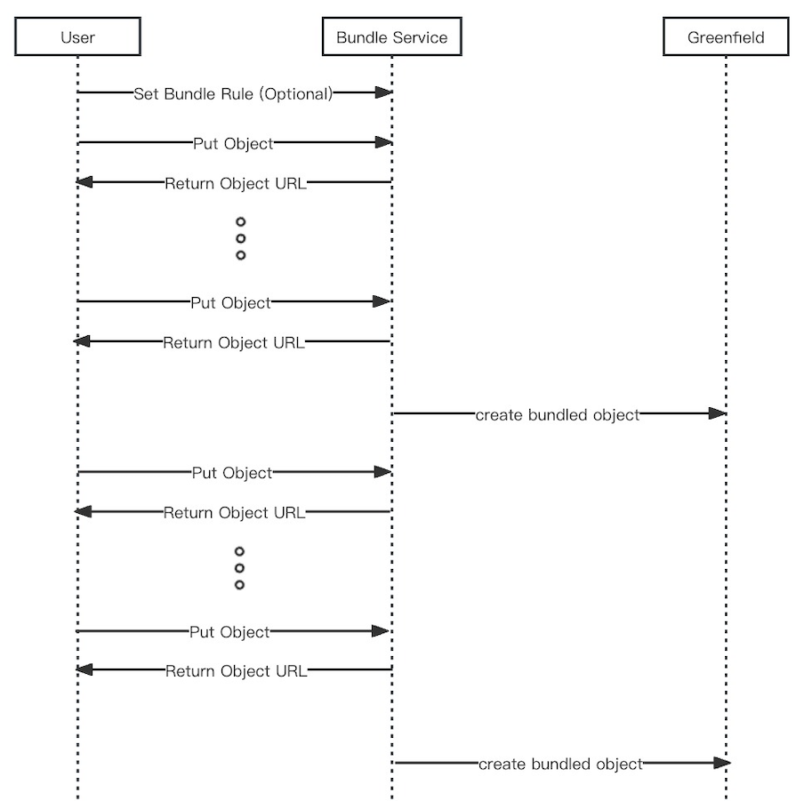
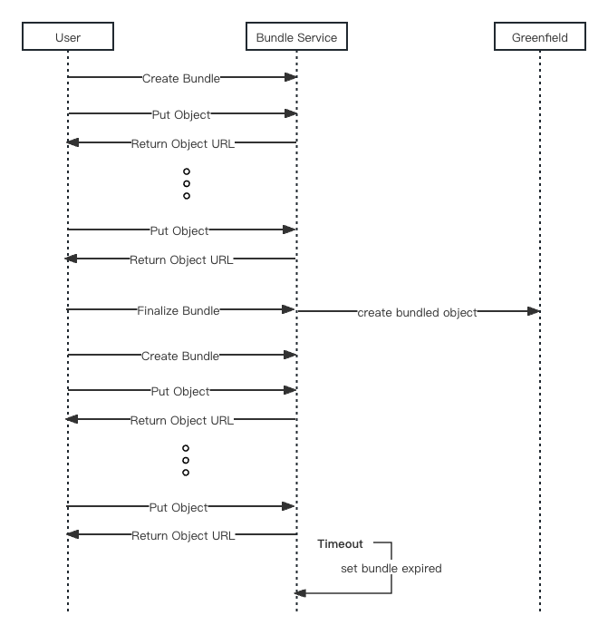
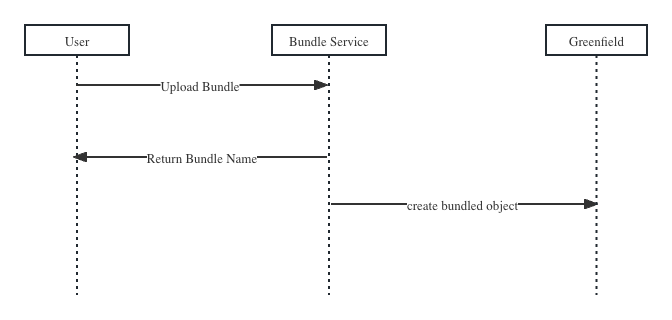
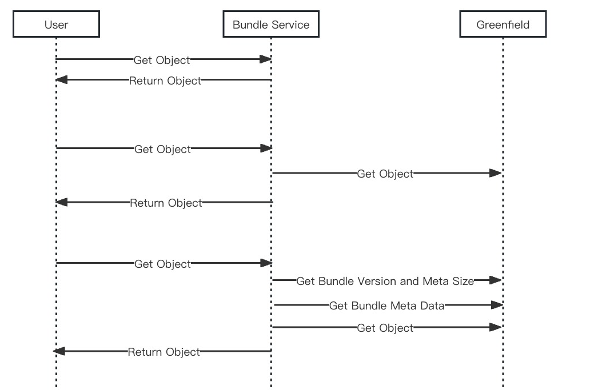

:::note
This blog post is contributed by [NodeReal](https://docs.nodereal.io/docs/greenfield-bundle-service).
:::

With more and more developers joining BNB Greenfield ecosystem, many good practices utilizing decentralized storage
continue to emerge. On the other hand, sending small files to Greenfield is not an economic way. When small files are
sent, the information about the files (metadata) saved in the system can be bigger than the files themselves. This means
it costs more for both the users and Greenfield. For instance, imagine a user's account wants to uploads a website to
Greenfield. If the files of the website are tiny but there are a lot of them, it leads to the same problem: too much
metadata and higher costs.

NodeReal has designed a bundling service to solve this problem. Bundling service provides a solution to small files
together into one big file before sending it to Greenfield.Thus, developers can can cut down unnecessary costs while
still get to each file in the big file as if they were separate.

NodeReal Bundling service is fully open sourced, developers can use NodeReal bundle service directly, while they can also
deploy their own bundle service if needed.

## Bundle Format
The bundle format specifies the structure and organization of the bundle that users create when packing files. This format
is designed to pack flat files; hierarchical directory structures, or folders, are not supported.

When dealing with a folder, we can simplify its structure by turning it into a series of individual files. As part of this
process, we rename each file to include the folder path. For example, a file originally named file.txt inside the nested
folders dira and dirb would be renamed to dira/dirb/file.txt. This approach allows us to maintain the organization of the
folder while conforming to the requirement for flat files in the bundle.

The bundle format is structured into several key components as follows:

* Version: This indicates the version number of the bundle protocol being used.
* Meta Size: This specifies the size of the bundle's metadata, allowing the construction of the bundle structure without the need to read the entire bundle.
* Metadata: This section contains information about the files within the bundle. It facilitates the ability to access files randomly, which means you can jump directly to any file within the bundle without going through all the files.
* Data: This portion represents the actual content and is comprised of all the files in bytes.

For more details, you can refer to the [BEP-323](https://github.com/bnb-chain/BEPs/pull/323) and [Bundle-SDK](https://github.com/bnb-chain/greenfield-bundle-sdk).

## Bundle Service

With the bundle format above, users now can pack their small objects into a bundle and upload the bundle file to Greenfield.
But users can not visit the objects in the bundle file conveniently.

The bundle service is designed to serve the users or dApps uploading a lot of small objects to Greenfield and provide an
indexing service for the objects in the bundle. Users can upload small objects to the bundle service and the bundle service
will pack the small files into a bundle and upload it to Greenfield, at the same time, the bundle service will also provide
a URL to visit each object in the bundle file.

The bundle service will upload the bundle file to the bucket that the user specified, so the user should grant the account
of the bundle service permission to upload files to the bucket. Meanwhile, the user should also grant the transaction fee
for the bundle service to upload objects to Greenfield.

### Architecture

The bundle service contains two main components: API service and Bundler.


#### API Service
The API service will serve users' requests like uploading an object, querying an object, etc.

#### Bundler
The bundler will pack the objects that the user uploaded into a bundle file and upload it to a bucket in Greenfield.

### Main Workflows
It is important to understand that the Bundler service uploads bundled files to the user's bucket, the user has absolute
control over the bundle files. This level of control allows users to manage and manipulate their bundled files as needed
effectively.

The bundle service utilizes its own account to send transactions and submit bundled files to Greenfield. Users are responsible
for covering the transaction fees, and they need to grant authorization to the bundler account to create new files under
their bucket. Therefore, it is essential to complete the necessary authorization before using the bundler service.

Greenfield can manage permissions for buckets and files. However, to keep the bundler service streamlined, complex permission
management is currently not available. The bundler service only supports public buckets, allowing only the bucket owner
to upload files. However, all users can access the files through the bundler service with no authorization.

#### Grant Permission


* Step 1: Before using the Bundle service, the user needs to create a bucket on Greenfield, and the visibility should be public. To create a bucket with the greenfield-go-sdk, use the following API. For a GUI option, you can use DCellar to create a new bucket.
```go
func (c *Client) CreateBucket(ctx context.Context, bucketName string, primaryAddr string, opts types.CreateBucketOptions) (string, error)
```

* Step 2: To ensure optimal performance when uploading bundled files to Greenfield, the bundler service offers multiple operator addresses. Get the operator address for creating the bundled objects on Greenfield.

* Step 3: Grant fee and permission for creating bundled objects under the bucket. For the fee grant,  you can only create a fee allowance for object creation.
```go
func (c *Client) GrantAllowance(ctx context.Context, granteeAddr string, allowance feegrant.FeeAllowanceI, txOption gnfdsdktypes.TxOption) (string, error)

// NewAllowedMsgAllowance creates new filtered fee allowance.
func NewAllowedMsgAllowance(allowance FeeAllowanceI, allowedMsgs []string) (*AllowedMsgAllowance, error)
```
  For the permission grant, you can use the following APIs to grant permission only for object creation.
```go
func (c *Client) PutBucketPolicy(ctx context.Context, bucketName string, principalStr types.Principal,
statements []*permTypes.Statement, opt types.PutPolicyOption,
) (string, error)

func NewPrincipalWithAccount(principalAddr sdk.AccAddress) (types.Principal, error)

func NewStatement(actions []permTypes.ActionType, effect permTypes.Effect,
resource []string, opts types.NewStatementOptions,
) permTypes.Statement

```

#### Upload Object
The bundle will be frozen if any of the following conditions are met:
-  The size of the bundle is equal to or greater than the MaxBundledSize, which has a default value of 1GB.
-  The number of objects in the current bundle is equal to or greater than the MaxBundledNumber, which has a default value of 1000.
-  The time interval since the creation of the bundle is equal to or greater than the MaxFinalizeTime, which has a default value of 24 hours.

Users can also define their own rules for MaxBundledSize , MaxBundledNumber , and MaxFinalizeTime , but the values should not exceed the default ones.

In this mode, when the previous bundle is frozen, if there are any new files uploaded, the bundler service will automatically create a new bundle for the user, eliminating the need for any additional user intervention. The bundles created by the bundler service follow the naming format of {bundle_prefix}_{bundle_nonce} . The bundle_prefix is bundle by default, and  bundle_nonce is the number of bundles created in the bucket.



In addition, users have the option to fully specify the lifecycle of a bundle by creating a new bundle using the "create bundle" API and then requesting to submit the bundle to Greenfield through the "seal bundle" API. It is important to note that the time from bundle creation to sealing should not exceed the DeaultMaxBundledTime of 24 hours. If this time limit is exceeded, the bundle service will automatically set the bundle as expired and the user can not finalize the bundle anymore.



The bundler service is primarily designed to address the storage performance and efficiency issues associated with small files. Therefore, it is important to note that the file size uploaded to the bundle service should not exceed 16 MB. Any file exceeding this limit will be rejected by the bundle service.

#### Upload Bundle
Since users may want to upload files at the same time like uploading a website, the bundle service allows users to upload a valid bundle.

The bundle service will validate the uploaded bundle, if the bundle is invalid, the request will be rejected.

For the valid bundle, it will index all the files in the bundle so the user can visit the files in the bundle like the objects uploaded via UploadObject API.

Unlike the UploadObject API, the user must specify the bundle name when uploading a bundle and the user are not allowed to upload objects to this bundle any longer. The bundle will be marked as Finalized and it will be uploaded to Greenfield by the bundle service.



#### Query Object
The Bundle service stores index information for uploaded objects. It tracks the bundle and its metadata, making it easy to locate and index files bundled on Greenfield. The service also caches frequently accessed data to improve request performance.
- When the bundler service has the file saved, the bundler service can respond to the request immediately.
- If only the index information is available, the bundle service retrieves the file from Greenfield and returns it to the user.
- If the index is missing, the service attempts to rebuild it from Greenfield and then retrieves and returns the file.



### APIs
The Bundle Service Server API provides several endpoints for managing and interacting with bundles. Here's a brief overview:

- **Upload a single object to a bundle (POST /uploadObject):** This endpoint allows users to upload a single object to a bundle, requiring details like bucket name, file name, and etc.
- **Upload a bundle (POST /uploadBundle):** This endpoint allows users to upload a bundle of objects, requiring details like bucket name, bundle name, and etc.
- **Retrieve an object as a file from a bundle (GET /view/{bucketName}/{bundleName}/{objectName}):** This endpoint fetches a specific object from a given bundle and returns it as a file.
- **Download an object as a file from a bundle (GET /download/{bucketName}/{bundleName}/{objectName}):** This endpoint allows users to download a specific object from a given bundle and returns it as a file.
- **Query bundle information (GET /queryBundle/{bucketName}/{bundleName}):** This endpoint queries a specific object from a given bundle and returns its related information.
- **Query bundling bundle information of a bucket (GET /queryBundlingBundle/{bucketName}):** This endpoint queries the bundling bundle information of a given bucket.
- **Start a New Bundle (POST /createBundle):** This endpoint initiates a new bundle, requiring details like bucket name and bundle name.
- **Finalize an Existing Bundle (POST /finalizeBundle):** This endpoint completes the lifecycle of an existing bundle, requiring the bundle name for authorization.
- **Delete an Existing Bundle (POST /deleteBundle):** This endpoint deletes an existing bundle after object deletion on Greenfield.
- **Get Bundler Account for a User (POST /bundlerAccount/{userAddress}):** This endpoint returns the bundler account for a given user.
- **Set New Bundling Rules (POST /setBundleRule):** This endpoint allows users to set new rules or replace old rules for bundling, including constraints like maximum size and number of files.

For more detailed information about each endpoint, including required parameters and response formats, please refer to the swagger.yaml file in https://github.com/node-real/greenfield-bundle-service.

For detailed usage cases, you can refer to the e2e test cases in https://github.com/node-real/greenfield-bundle-service/tree/main/e2e.


### Endpoints

#### Greenfield Testnet
Using the testnet's bundle service, the bundle file will be uploaded to the Greenfield testnet. Endpoint:
```
https://gnfd-testnet-bundle.nodereal.io
```

#### Greenfield Mainnet
Coming soon...
