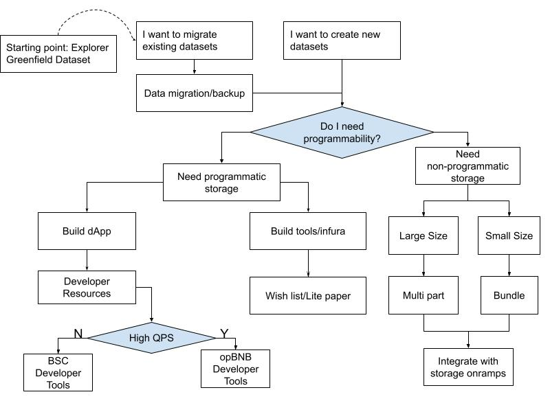

Here’s a quick guide to get you from zero to hero. This doc provides a guide to the following ideas:

* Greenfield & Programmability concepts

* Understand what you need to build your project

* Access resources to get you started

## Greenfield & Programmability Concepts

### Greenfield 101

https://docs.bnbchain.org/greenfield-docs/docs/guide/introduction/overview

### Uniform Address Format

Greenfield defines its account in the same format as BSC and Ethereum. It starts with ECDSA secp256k1 curve for keys and is compliant with [EIP84](https://github.com/ethereum/EIPs/issues/84) for full [BIP44](https://github.com/bitcoin/bips/blob/master/bip-0044.mediawiki) paths.

https://docs.bnbchain.org/greenfield-docs/docs/guide/core-concept/accounts

### Account Operation

Create a greenfield account, deposit BNB, and program token transfers.

### Data storage

Create a public bucket to upload and share objects.

### Permission control

Create a private bucket and share it with specific individuals.

### Enhanced permission control

- Create a group, add members, and share the private bucket.

- Resource management with smart contracts: Understand the concepts of resource mirroring https://docs.bnbchain.org/greenfield-docs/docs/guide/core-concept/cross-chain/mirror

### A Quick Start about Data Access Control Through Smart Contract

- Understand the concepts: https://docs.bnbchain.org/greenfield-docs/docs/guide/core-concept/programmability
- Smart Contract SDK: https://docs.bnbchain.org/greenfield-docs/docs/tutorials/access-control/quick-start

### Show Case: Data Marketplace

https://docs.bnbchain.org/greenfield-docs/docs/tutorials/data-marketplace/overview

## Developer Starter Kit

### SDK

- [Greenfield Go SDK](https://docs.bnbchain.org/greenfield-docs/docs/sdks/sdk-go), more details refer to [Go SDK Docs](https://pkg.go.dev/github.com/bnb-chain/greenfield-go-sdk).
- [Greenfield Javascript SDK](https://docs.bnbchain.org/greenfield-docs/docs/sdks/sdk-js), more details refer to [JS SDK Docs](https://docs.bnbchain.org/greenfield-js-sdk/).

### Examples

- https://docs.bnbchain.org/greenfield-docs/docs/sdks/sdk-go
- https://docs.bnbchain.org/greenfield-docs/docs/sdks/sdk-js
- https://github.com/bnb-chain/greenfield-python-sdk/tree/main/examples

## Setup

- Key management: https://docs.bnbchain.org/greenfield-docs/docs/guide/core-concept/key-management
- Transfer between greenfield address
- Token bridge

## What to build

Follow the decision-making guide below, to see which resource is recommended for your use case:

### Wishlist

- https://github.com/bnb-chain/community-contributions/blob/main/bnb-greenfield-wishlist-corechain.md
- https://github.com/bnb-chain/community-contributions/blob/main/bnb-greenfield-wishlist-dapp.md

### Developer Resource

- Explore datasets with [explorer](https://greenfieldscan.com/) or [dcellar.io ](https://dcellar.io/)

- RPC: https://docs.bnbchain.org/greenfield-docs/docs/api/endpoints

- Web hosting: https://docs.bnbchain.org/greenfield-docs/docs/tutorials/dapp/4everland-hosting/overview

- BSC developer tools https://docs.bnbchain.org/docs/learn/ecosystem

- opBNB developer tools https://docs.bnbchain.org/opbnb-docs/docs/build-on-opbnb/developer-tools

- Data Marketplace boilerplate

- - Frontend: https://github.com/bnb-chain/greenfield-data-marketplace-frontend
  - Smart Contracts: https://github.com/bnb-chain/greenfield-data-marketplace-contracts

### Storage onramp

https://dcellar.io/

