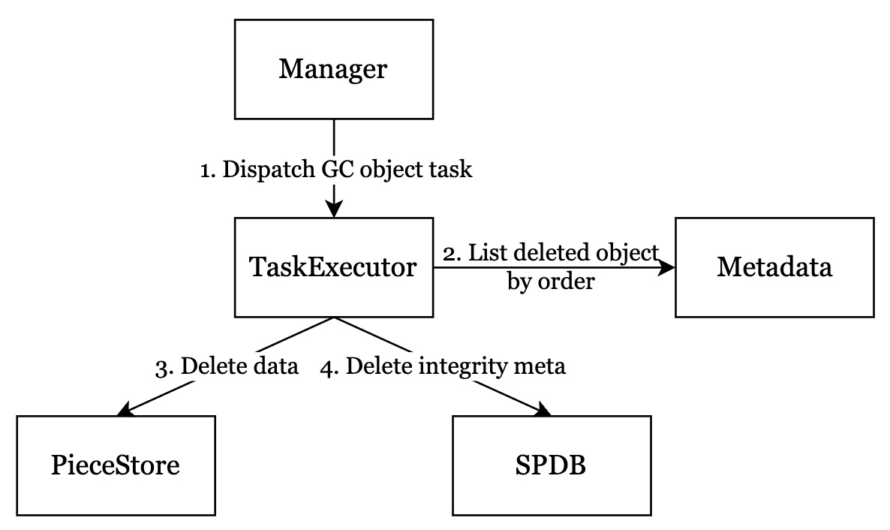
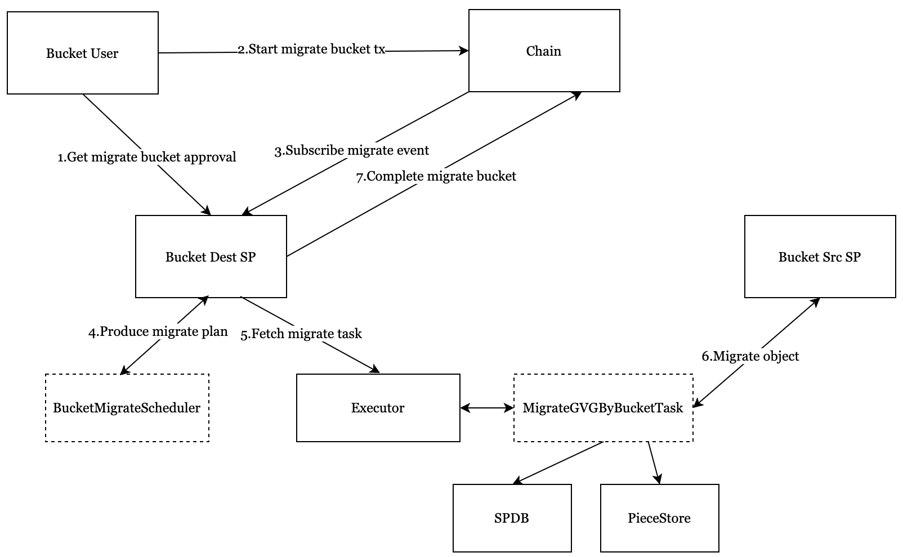
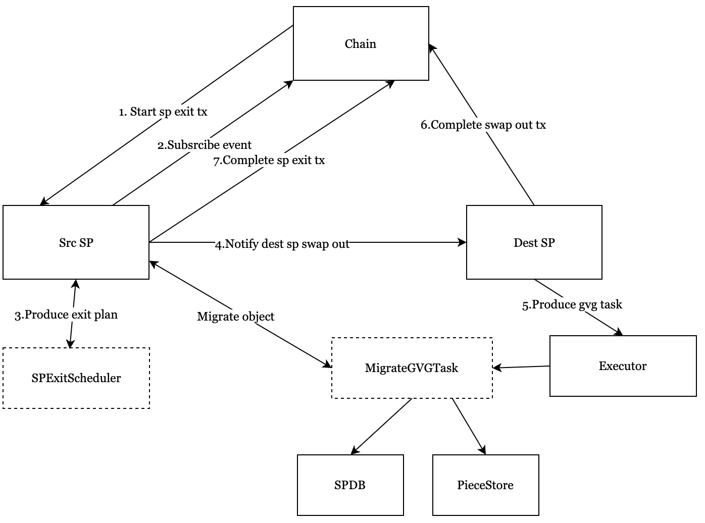

# SP Workflow

This section will combine all the current and existing workflows of SP to help you understand how SP works and how internal state flows.

## Get Approval

[Get Approval](../../../api/storgae-provider-rest/get_approval) API includes actions: CreateBucket and CreateObject. To upload an object into SP, you must first send a CreateBucket approval request, which will create a bucket on the Greenfield blockchain. If the request is successful, you can then send a CreateObject approval request. Both of these actions are used to determine whether SP is willing to serve the request. SP may reject users with a bad reputation or specific objects or buckets. SP approves the request by signing a message for the action and responding to the users. By default, SP will serve the request, but it can refuse if it chooses to do so. Each SP can customize its own strategy for accepting or rejecting requests.

The flow chart is shown below:

<i>Get Approval</i>

- Gateway receives GetApproval requests from the request originator.
- Gateway verifies the signature of request to ensure that the request has not been tampered with.
- Gateway invokes Authenticator to check the authorization to ensure the corresponding account is existed.
- Gateway invokes Approver to fills the CreateBucket/CreateObject message timeout field and dispatches the request to Signer service.
- Gets Signature from Signer, fills the message's approval signature field, and returns to the request originator.

**Note**

By default, each account can create a maximum of 100 buckets.

If users send multiple CreateBucket or CreateObject approval requests in a short period of time, SP will provide the same results due to an expired blockchain height that is set to prevent repeated requests, such as DDoS attacks.

See request and response details for this API: [GetApproval](../../../api/storgae-provider-rest/get_approval).

## Upload Object

After successfully sending requests to the [GetApproval](https://greenfield.bnbchain.org/docs/api-sdk/storgae-provider-rest/get_approval.html) API and receiving results, you can upload an object to SP. This API involves two steps: first, users manually upload an object to PrimarySP; second, after a successful upload to PrimarySP, the object is automatically replicated to secondarySP to ensure data reliability.

Upload to PrimarySP flow chart is shown below:

<i>Put Object</i>

### [Gateway](../modules/gateway)

- Gateway receives PutObject requests from client.
- Gateway verifies the signature of request to ensure that the request has not been tampered with.
- Gateway invokes Authenticator to check the authorization to ensure the corresponding account has permissions on resources.
- Dispatches the request to Uploader module.

### [Uploader](../modules/uploader)

- Uploader accepts object data in a streaming format and divides it into segments based on the `MaxSegmentSize`, which is determined by consensus in the Greenfield chain. The segmented data is then stored in the PieceStore.
- Uploader creates a JobContext with an initial state of `INIT_UNSPECIFIED`. Upon beginning the upload of segments, the JobContext's state transitions to `UPLOAD_OBJECT_DOING`. Once all segments have been uploaded, the JobContext's state changes to `UPLOAD_OBJECT_DONE`. In the event of any abnormal situations during the upload, the JobContext's state will change to `UPLOAD_OBJECT_ERROR`.
- After uploading all segments, insert segments data checksums and root checksum into the SP DB.
- Uploader creates an upload object task for Manager and returns a success message to the client indicating that the put object request is successful.

### [TaskExecutor](../modules/taskexecutor)

Replicate to SecondarySP flow chart is shown below:

<i>Replicate Object</i>

- Executor fetch ReplicatePieceTask from the Manager which help pick a proper virtual group.
- The object data is asynchronously replicated to virtual group secondary SPs.
- TaskExecutor retrieves segments from the PieceStore in parallel and uses `Erasure Coding(EC)` to compute a data redundancy solution for these segments, generating the corresponding EC pieces. The EC pieces are then organized into six replicate data groups, with each group containing several EC pieces based on the Redundancy policy.
- Then sends the replicate data groups in streaming to the selected secondary SPs in parallel.
- The JobContext's secondary SP information is updated once the replication of a secondary SP is completed. The JobContext's state changes from `REPLICATE_OBJECT_DOING` to `REPLICATE_OBJECT_DONE` only after all secondary SPs have completed replication.

### [Receiver](../modules/receiver)

- Receiver checks whether the SecondarySP approval is self-signed and has timed out. If either of these conditions is true, the system returns a `SIGNATURE_ERROR` to TaskExecutor.
- Receiver works in secondary SP, receives EC pieces that belong to the same replicate data group, and uploads the EC pieces to the secondary SP PieceStore.
- Computes the EC pieces integrity checksum, sign the integrity checksum by SP's approval private key, then returns these to TaskExecutor.

### [TaskExecutor](../modules/taskexecutor)

- Receives the response from secondary SPs' Receiver, and unsigned the signature to compare with the secondary SP's approval public key.
- Sends the MsgSealObject to the Signer for signing the seal object transaction and broadcasting to the Greenfield chain with the secondary SPs' integrity hash and signature. The state of the JobContext turns to `SIGN_OBJECT_DOING` from `REPLICATE_OBJECT_DONE`. If Signer succeeds to broadcast the SealObjectTX, changes `SEAL_OBJECT_TX_DOING` state immediately into `SIGN_OBJECT_DONE` state.
- Monitor the execution results of seal object transaction on the Greenfield chain to determine whether the seal is successful. If so, the JobContext state is changed into `SEAL_OBJECT_DONE` state.

See request and response details for this API: [PutObject](../../../api/storgae-provider-rest/put_object).

## Download Object

Users can download an object from PrimarySP. The flow chart is shown below:

<i>Get Object</i>

### [Gateway](../modules/gateway)

- Receives the GetObject request from the client.
- Verifies the signature of request to ensure that the request has not been tampered with.
- Checks the authorization to ensure the corresponding account has permissions on resources.
- Checks the object state and payment account state to ensure the object is sealed and the payment account is active.
- Dispatches the request to Downloader.

### [Downloader](../modules/downloader)

- Receives the GetObject request from the Gateway service.
- Check whether the read traffic exceeds the quota.
    * If exceeds the quota, the Downloader refuses to serve and returns a not-enough-quota error to the Gateway.
    * If the quota is sufficient, Downloader inserts read record into the SP traffic-db.
- Downloader splits the GetObject request into GetPiece requests (which support range reads) to retrieve the corresponding piece payload data. Downloader then streams the object payload data back to the Gateway.

See request and response details for this API: [GetObject](../../../api/storgae-provider-rest/put_object).

## QueryMeta

Users maybe want to query some metadata about buckets, objects, bucket read quota or bucket read records from SP. SP provides related APIs about querying metadata. The flow chart is shown below:

<i>Query Meta</i>

### [Gateway](../modules/gateway)

- Receives the QueryMeta request from the client.
- Verifies the signature of request to ensure that the request has not been tampered with.
- Checks the authorization to ensure the corresponding account has permissions on resources.
- Dispatches the request to Metadata.

### Metadata

- Metadata receives the QueryMeta request from Gateway.
- Metadata queries bucket or object from SP DB or BS DB.

## Get Challenge Piece Info

Ensuring data integrity and availability is always the top priority for any decentralized storage network. To achieve better high availability (HA), we use data challenges instead of storage proofs. The system continuously issues data challenges to random pieces on the greenfield chain, and SP that stores the challenged piece responds using the challenge workflow. Each SP splits the object payload data into segments, stores the segment data in the PieceStore, and stores the segment checksum in SP DB.

The flow chart is shown below:

<i>Challenge</i>

### [Gateway](../modules/gateway)

- Receives the Challenge request from the client.
- Verifies the signature of request to ensure that the request has not been tampered with.
- Checks the authorization to ensure the corresponding account has permissions on resources.
- Dispatches the request to Downloader.

### [Downloader](../modules/downloader)

- Downloader receives the Challenge request from Gateway.
- Returns all segment data checksums and challenge segment data payload to Gateway.
    * Retrieve all segment data checksums from the SP DB.
    * Get the challenge segment data from PieceStore.

## GC Object

GC is used to delete objects whose metadata on Greenfield chain has already been deleted, reducing the cost of each SP and data size in Greenfield chain. This function is automatically executed in Manager daemon mode.

The flow chart is shown below:

<i>GC Object</i>

- Manager dispatches GCObjectTask to TaskExecutor.
- TaskExecutor send requests to Metadata to query deleted objects in order.
- TaskExecutor delete payload data which is stored in PieceStore.

## Migrate Bucket

Bucket user can select primary sp freely and use the migration bucket to migrate the sp service when they feel that the SP service quality is poor.

The flow chart is shown below:

<i>Migrate Bucket</i>

- The bucket user should ask new primary sp for migration bucket, and get the approval of the new primary SP.
- The bucket user submits a MigrationBucket transaction with the approval of the new primary SP.
- The dest sp subscribes event from chain, and produce migrate execute plan.
- The dest sp executor fetch migrate gvg task to execute, and period report progress.
- The dest sp sends the complete tx if all the gvg task are completed in execute plan.

## SP Exit

Greenfield allows for the participation of SPs and also allows them to exit according to their wishes.

The flow chart is shown below:

<i>SP Exit</i>

- The src sp self applying for exit by sending the StorageProviderExit transaction to the blockchain.
- The src sp subscribes event from chain, and produce exit execute plan.
- The src sp dispatches swap out info dest sp.
- The dest sp produces gvg migrate task by swap out unit.
- The dest sp executor fetch migrate gvg task to execute, and period report progress.
- The dest sp sends the complete swap out tx if all the gvg task are completed in swap out.
- The src sp sends the complete sp exit tx if all the swap out are completed.
