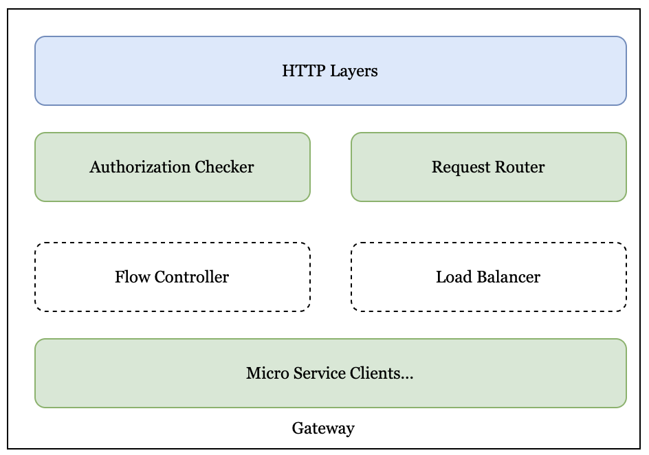

# Gateway

The Gateway service serves as the unified entrance of HTTP requests for SP, providing a standardized `HTTP RESTful API` for application programming.
If you are interested in the HTTP Restful API, we invite you to the [following page](https://greenfield.bnbchain.org/docs/api-sdk/storgae-provider-rest/).

## Overview



<div style={{textAlign:'center'}}><i>Gateway Architecture</i></div>

### Authorization Checker

Gateway provides unified authorization for each HTTP request from the fowllowing three aspects:

- Verifies the signature of request to ensure that the request has not been tampered with.
- Checks the authorization to ensure the corresponding account has permissions on resources.
- Checks the object state and payment account state to ensure the object is sealed and the payment account is active.

### Request Router

Based on the specific request type, it is routed to the corresponding backend microservice.

### Flow Control

Based on the flow control configuration policies, flow control will be performed to provide higher-quality services and avoid service overload.

### Load Balancer(LB)

In the future, when routing traffic to backend microservices in SP, SP Gateway would use LB to do this. LB is a method of distributing API request traffic across multiple upstream services. LB improves overall system responsiveness and reduces failures by preventing overloading of individual resources.

### Middleware

SP Gateway uses middleware to collect metrics, logging, register metadata and so on.

### Universal Endpoint

We implement the Universal Endpoint according to [Greenfield Whitepaper Universal Endpoint](https://github.com/bnb-chain/greenfield-whitepaper/blob/main/part3.md#231-universal-endpoint).

All objects can be identified and accessed via a universal path: gnfd://<bucket_name><object_name>?[parameter]*

Explanation:

- The beginning identifier `gnfd://` is mandatory and cannot be changed..
- `bucket_name` is the bucket name of the object and is mandatory.
- `object_name` is the name of the object and is mandatory.
- The parameter is an optional list of key-value pairs that provide additional information for the URI.

Each SP will register multiple endpoints to access their services, e.g. "SP1" may ask their users to download objects via `https://gnfd-testnet-sp-1.bnbchain.org/download`.
And the full download RESTful API would be like: `https://gnfd-testnet-sp-1.bnbchain.org/download/mybucket/myobject.jpg`.

Universal Endpoint supports using any valid endpoint for any SP, and automatically redirects to the correct endpoint containing the object for downloading.

For instance, when users access a testnet endpoint `gnfd-testnet-sp-1.bnbchain.org` of SP1, the request URL will be: `https://gnfd-testnet-sp-1.bnbchain.org/download/mybucket/myobject.jpg`. Universal Endpoint will find the correct endpoint for myobject.jpg, here SP3, and redirect the user to: `https://gnfd-testnet-sp-3.bnbchain.org/download/mybucket/myobject.jpg` and download the file.


<div style={{textAlign:'center'}}><i>Universal Endpoint Logic Flow</i></div>

#### Download File

If you want to download a file using Universal Endpoint, downloading URL is like: `https://gnfd-testnet-sp-1.bnbchain.org/download/mybucket/myobject.jpg`. This is enforced by adding this Content-Type to HTTP headers:

```text
Content-Disposition=attachment
```

#### View File

If you want to view a file using Universal Endpoint, viewing url is like: `https://gnfd-testnet-sp-1.bnbchain.org/view/mybucket/myobject.jpg`. This is enforced by adding this Content-Type to HTTP headers:

```text
Content-Disposition=inline
```

#### Public File Access

Public files can be downloaded/viewed with the following points to notice:

1. Downloader/Viewer's quota will not be deducted, but the object owner's quota will be deducted per `download or view`.
2. If a file's public or private status is not specified, its accessibility as a public or private file is determined by the status of the bucket it resides in, and whether it can be downloaded or viewed.
3. If a file is not sealed, it cannot be `downloaded or viewed`.

#### Private File Access

Access private file is in design and will be provided in the new few releases. Currently, if you try to download or view a private file, an error will be thrown to let you know the object key you are using is illegal.
