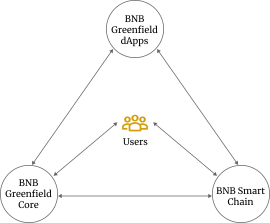
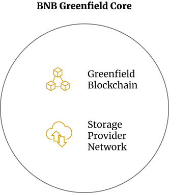

# High Level Architecture

## The Architecture in General

<i>Figure Greenfield Economy General Architecture</i>

The ecosystem of Greenfield is a "trinity" as shown in the above figure.

### Greenfield Core

BNB Greenfield Core is the center of the new ecosystem of data. It has two
layers.

1. A new storage-oriented blockchain, and

2. A network composed of "storage providers".

The BNB Greenfield blockchain maintains the ledger for the users and the
storage metadata as the common blockchain state data. It has BNB,
transferred from BNB Smart Chain, as its native token for gas and
governance. BNB Greenfield blockchain also has its own staking logic for
governance.

Storage Providers (SP) are storage service infrastructures that
organizations or individuals provide and the corresponding roles they
play. They use Greenfield as the ledger and the single source of truth.
Each SP can and will respond to users' requests to write (upload) and
read (download) data, and serve as the gatekeeper for user rights and
authentications.

Initially, a number of validators, run either by the BNB community or
SPs, go through the genesis to launch BNB Greenfield, while a few SPs
will also launch the corresponding storage infrastructure and register
themselves onto the Greenfield blockchain. SPs form another P2P network
to provide the full feature set to applications and users to create,
store, read, and trade data while using Greenfield blockchain as the
metadata and ledger layer.

<i>Figure BNB Greenfield Core</i>

BNB Greenfield blockchain and the SPs together comprise the center of
this new economy, which is actually a decentralized, object storage
system (with EVM connectivity as explained later).

In contrast to the centralized alternative, this object storage system
manages its data in two collaborative parts, on-chain, and off-chain.

The Greenfield blockchain contains two categories of states "on-chain":

1. Accounts and their BNB balance ledger

2. The metadata of the object storage system and SPs, the metadata of the objects stored on this storage system, and the
   permission and billing information associated with this storage system.

Greenfield blockchain transactions can change the above states. These
states and the transactions comprise the major economic data of BNB
Greenfield.

While the metadata is stored on-chain, the object storage system stores
all the object content data (the payload) off-chain, more precisely, on
SPs' off-chain systems in a decentralized and redundant way.

When users want to create and use the data on Greenfield, they may
interact with the BNB Greenfield Core Infrastructure via BNB Greenfield
dApps (decentralized applications).

### BNB Greenfield dApps

BNB Greenfield dApps are new types of decentralized applications. They
can be the client toolings that facilitate users to interact with the
decentralized storage system, Greenfield Core Infra; or applications
that bring real values to users' real life by using Greenfield systems
as their infrastructure. These applications will use blockchain
addresses as user identifiers and interact with features and smart
contracts on the Greenfield blockchain, Greenfield SPs, and BSC.

There are data endpoints, transaction interfaces, P2P networks, and
corresponding SDKs to help developers to build BNB Greenfield dApps.

BNB Greenfield dApps should be part of the establishment of BNB Chain
infrastructure built mostly by the community and ecosystem partners.
They can be decentralized or centralized as they prefer.

### The Cross-Chain with BSC

There is a native cross-chain bridge between BSC and BNB Greenfield
blockchain. While the data can be created and read more cheaply on
Greenfield Core Infra, the relevant data operation can be transferred to
BSC and integrated with smart contract systems there, such as DeFi, to
create new business models.

### The Trinity

From the viewpoint of BNB Greenfield dApps, these applications can help
users to create, read, and execute data on the BNB Greenfield,
Greenfield SPs, and BSC, and serve a purpose to users' needs.

From the viewpoint of BNB Greenfield Core Infrastructure, they accept
requests and observations from the Greenfield dApps on behalf of the
users, and also instructions from BSC to operate together for different
business scenarios.

From the viewpoint of BSC, they can accept transferred data assets from
BNB Greenfield, and provide more business scenarios via smart contracts
to new types of Greenfield dApps.

The users can interact with all parts of the trinity for different
purposes directly or/and indirectly.

## BNB Greenfield Core

### The BNB Greenfield Blockchain

BNB Greenfield blockchain uses Proof-of-Stake based on
Tendermint-consensus for its own network security. Blocks are created
every 2 seconds on the Greenfield chain by a group of validators.

BNB will be the gas and governance token on this blockchain. There is a
native cross-chain bridge between the Greenfield blockchain and BSC. The
initial BNB will be locked on BSC and re-minted on Greenfield. BNB and
data operation primitives can flow between Greenfield and BSC.

Total circulation of BNB will stay unchanged as it is now but flow among
BNB Beacon Chain, BSC, and Greenfield.

The validator election and governance are based on a proposal-vote
mechanism, which is revised based on Cosmos SDK's governance module:
anyone can create and propose to become a validator, and the election
into the active set will be based on the stake ranking (initially new
validators may request the existing validator set's votes to be
qualified for election). As validators will host all the critical
metadata and respond to all data operation transactions, they should run
professionally in terms of performance and stability.

To facilitate cross-chain operation and convenient asset management, the
address format of the Greenfield blockchain will be fully compatible
with BSC (and Ethereum). It also accepts EIP712 transaction signing and
verification. These enable the existing wallet infrastructure to
interact with Greenfield at the beginning naturally.

### The Storage Providers, SPs

SPs play a different role from Greenfield validators, although the same
organizations or individuals can run both SPs and validators if they
follow all the rules and procedures to get elected.

SPs store the objects' real data, i.e. the payload data. Each SP runs its own object storage system. Similar to Amazon
S3 and other object store systems, the objects stored on SPs are immutable. The users may delete and re-create the
object (under the different ID, or under the same ID after certain publicly declared settings), but they cannot modify
it.

SPs have to register themselves first by depositing on the Greenfield
blockchain as their "Service Stake". Greenfield validators will go
through a dedicated governance procedure to vote for the SPs of their
election. SPs are encouraged to advertise their information and prove to
the community their capability, as SPs have to provide a professional
storage system with high-quality SLA.

SPs provide publicly accessible APIs for users to upload, download, and
manage data. These APIs are very similar to Amazon S3 APIs so that
existing developers may feel familiar enough to write code for it.
Meanwhile, they provide each other REST APIs and form another
white-listed P2P network to communicate with each other to ensure data
availability and redundancy. There will also be a P2P-based
upload/download network across SPs and user-end client software to
facilitate easy connections and fast data download, which is similar to
BitTorrent.

More SPs are welcome to ensure decentralization and data redundancy. But
too many SPs may make SPs unable to make enough to sustain the business.
Greenfield has an incentive design to make a proper number of SPs
available. While SPs can choose to stay with the network or leave.

When the SPs join and leave the network, they have to follow a series of
actions to ensure data redundancy for the users; otherwise, their
"Service Stake" will be fined. This is achieved through the data
availability challenge and validator governance votes.

### The Pair Synergy

Greenfield validators and SPs form a pair synergy to provide the whole
storage service. Validators store the metadata and financial ledger with
consensus, while SPs provide real data storage and downloading.
Validators have the motivation to ensure enough good SPs to provide
decent service, while users and SPs rely on a stable and decentralized
Greenfield blockchain as a single source of truth on metadata.

## The Greenfield Data Storage

The data stored on Greenfield has two main categories:

1. data with blockchain consensus - They are Greenfield blockchain data.
   All Greenfield validators have such active data in full (at least the latest state).
   Anyone can join the blockchain as full nodes to synchronize these data for free.

2. object payload data - object data for short. This is the data that users store on Greenfield.
   Such data has access control and requires fees to store.
   They are not stored on the blockchain but on enough instances of SPs off-chain.

### Data with Consensus

These data are on-chain and can be only changed through transactions
onto the Greenfield blockchain. It has several types as described below.

#### Accounts and Balance

Each user has their "Owner Address" as the identifier for their owner
account to "own" the data resources. There is another "payment account"
type dedicated to billing and payment purposes and owned by owner
addresses.

Both owner accounts and payment accounts can hold the BNB balance on
Greenfield. Users can deposit BNB from BSC, accept transfers from other
users, and spend them on transaction gas and storage usage.

#### Validator and SP Metadata

These are the basic information about the Greenfield validators and
Greenfield SPs. SPs may have more information, as it has to publish
their service information for users' data operations. There should be a
reputation mechanism for SPs as well.

#### Storage Metadata

The "storage metadata" includes size, ownership, checksum hashes, and
distribution location among SPs. Similar to AWS S3, the basic unit of
the storage is an "*object*", which can be a piece of binary data, text
files, photos, videos, or any other format. Users can create their
objects under their "*bucket*". A bucket is globally unique. The object
can be referred to via the bucket name and the object ID. It can also be
located by the bucket name, the prefix tag, and the object ID via
off-chain facilitations.

#### Permission Metadata

Data resources on Greenfield, such as the data objects and the buckets,
all have access control, such as which address can create, read, list,
or even execute the resources, and which address can grant/revoke these
permissions.

Two other data resources also have access control. One is "Group". A
group represents a group of user addresses that have the same
permissions to the same resources. It can be used in the same way as an
address in the access control. Meanwhile, it requires permission too to
change the group. The other is "payment account". They are created by
the owner accounts.

Here the access control is enforced by the SPs off-chain. People can
test and challenge the SPs if they mess up the control. Slash and reward
will happen to keep the SPs sticking to the principles.

#### Billing Metadata

Users have to pay fees to store data objects on Greenfield. While each
object enjoys a free quota to download by users who are permitted to,
the excessive download will require extra data packages to be paid for
the bandwidth. Besides the owner address, users can derive multiple
"Payment Addresses" to pay these fees. Objects are stored under buckets,
while each bucket can be associated with these payment addresses, and
the system will charge these accounts for storing and/or downloading.
Many buckets can share the same payment address. Such association
information is also stored on chains with consensus as well.

The payment of Greenfield is on a stream pay model, which will greatly
reduce the complexity to implement the billing logic - more described in
[billing and payment](../greenfield-blockchain/modules/billing-and-payment.md).

### Off-Chain Payload Object Data Storage

The payload data of the object, i.e. the bytes comprising the data
files, photos, and videos, are stored off-chain in multiple SPs with a
data redundancy design. Each SP can have its edition of an object
storage system with a good SLA and high-performance interface to
interact with the users and other SPs.

#### Primary and Secondary SPs

Among the multiple SPs that one object is stored on, one SP will be the
"Primary SP", while the others are "Secondary SP".

When users want to write an object into Greenfield, they or the client
software they use must specify the primary SP. Primary SP should be used
as the only SP to download the data. Users can change the primary SP for
their objects later if they are not satisfied with their service.

#### Data Redundancy

After the users issue a "write" request, Primary SP should respond to
the client upload request to accept the user upload, chop the object
data into segments, verify the data integrity and store all the segments.
After that, Primary SP computes a data redundancy solution for these segments
based on Erasure Coding (EC). Then Primary SP or the users will select a
few secondary SPs to store these segment replicas and their EC parity pieces.
This data distribution communication will be done via the p2p network and REST
APIs among SPs.

The data redundancy setup is to ensure that even if the primary SP and a
few secondary SPs become unavailable at a later time, Greenfield can
still recover the full data.