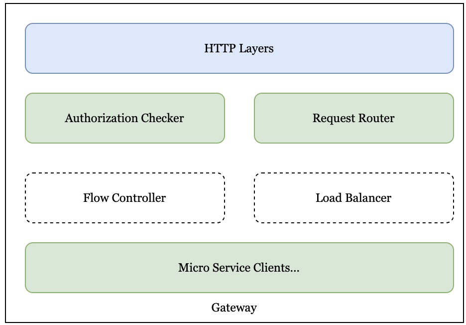

# Gateway
The Gateway service is the unified entrance of SP, which provides a unified application programming interface (HTTP Restful API).
If you are interested in the specific programming interface, we invite you to the [following page]().

## Overview

<i>Gateway Architecture</i>

### Permission Checker
According to the Authorization information, obtain the user information and check whether the corresponding user 
has the relevant action permission on the corresponding resource.

### Request Router
According to the type of specific request, it is forwarded to the corresponding backend microservice.

### Flow Controller
In the future, according to the flow control configuration information, flow control will be performed to provide 
higher-quality services and avoid service overload.

### Load Balancer
In the future, when routing back-end microservices, load balancing will be done according to policies such as 
service quality.

### Micro Service Clients
Various microservice clients inside SP, including Uploader, Downloader, etc.

